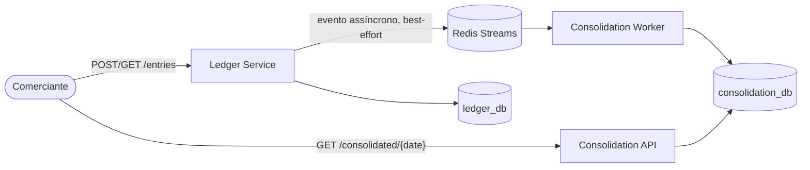

# Desafio Técnico — Solutions Architect: Controle de Fluxo de Caixa

Um comerciante precisa registrar seus lançamentos (débitos/créditos) e consultar o saldo diário consolidado. O código é a prova das decisões; as decisões estão explicadas em [`docs/`](docs/).

## Por onde começar

| Se você tem | Leia |
|---|---|
| **5 minutos** | Esta página até o fim de "Decisões-chave" |
| **15 minutos** | \+ [`01-requirements.md`](docs/01-requirements.md) (a separação dos 2 RNFs escondidos no enunciado) e o diagrama em [`02-target-architecture.md`](docs/02-target-architecture.md) |
| **Avaliação completa** | A ordem numérica de [`docs/`](docs/), com os [ADRs](docs/adr/) depois do `02` |

Se for ler um único arquivo, que seja [`01-requirements.md`](docs/01-requirements.md): é a análise de requisitos que sustenta todas as decisões seguintes.

## A solução em uma imagem



Dois bounded contexts, comunicação assíncrona via evento — não porque o volume exige (50 req/s é modesto), mas porque o enunciado exige explicitamente que o Lançamentos **nunca fique indisponível por causa do Consolidado**.

## Decisões-chave

Justificativa completa, com as alternativas descartadas, nos [ADRs](docs/adr/).

- **Dois serviços, comunicação assíncrona via evento** (não chamada síncrona, não monólito modular) — consequência direta do requisito "Lançamentos não pode cair se Consolidado cair". [ADR 0001](docs/adr/0001-event-driven-vs-sincrono.md)
- **Banco de dados por serviço** — nenhum recurso compartilhado que uma sobrecarga de leitura possa usar para afetar a escrita. [ADR 0002](docs/adr/0002-database-per-service.md)
- **Read model materializado no Consolidado** — leitura vira um `SELECT` por chave primária, não uma agregação on-the-fly. [ADR 0003](docs/adr/0003-read-model-materializado.md)
- **Publicação best-effort (não outbox transacional) neste desafio** — simplificação documentada, com o outbox registrado como recomendação de produção. [ADR 0005](docs/adr/0005-outbox-vs-publish-best-effort.md)
- **Consumidor idempotente** — obrigatório, não opcional, dado que o broker entrega at-least-once. [ADR 0006](docs/adr/0006-consumidor-idempotente.md)
- **Cache + load shedding no Consolidado** — converte sobrecarga em perda orçada e mensurável (a métrica que prova RNF-2), em vez de degradação incontrolável. [ADR 0007](docs/adr/0007-cache-e-load-shedding.md)

Os dois testes que provam os requisitos não-funcionais em código: `test_event_publisher_resilience.py` (falha ao publicar o evento nunca derruba o `POST /entries` — RNF-1) e `test_idempotency.py` (reprocessar o mesmo evento não duplica o saldo).

## Mapa da documentação

| Documento | Conteúdo |
|---|---|
| [`00-domain-mapping.md`](docs/00-domain-mapping.md) | Domínios funcionais, capacidades de negócio, context map |
| [`01-requirements.md`](docs/01-requirements.md) | Requisitos funcionais/não-funcionais refinados |
| [`02-target-architecture.md`](docs/02-target-architecture.md) | Arquitetura alvo em AWS, diagramas C4 e de sequência |
| [`adr/`](docs/adr/) | 7 Architecture Decision Records, com as alternativas descartadas |
| [`03-api-contracts.md`](docs/03-api-contracts.md) | Contratos das duas APIs e do evento interno |
| [`04-observability.md`](docs/04-observability.md) · [`05-security.md`](docs/05-security.md) · [`06-cost-estimate-aws.md`](docs/06-cost-estimate-aws.md) | Diferenciais: observabilidade, segurança, custos AWS |
| [`07-testing-strategy.md`](docs/07-testing-strategy.md) · [`08-future-work.md`](docs/08-future-work.md) | Estratégia de testes e o que eu faria com mais tempo |

## Rodando localmente

Pré-requisitos: Docker e Docker Compose.

```bash
cp .env.example .env   # opcional — os defaults já funcionam
docker compose up --build
```

Sobe Postgres (com os 2 bancos lógicos), Redis (cache + broker local — [ADR 0004](docs/adr/0004-broker-local-vs-aws.md)), os dois serviços, o worker e Prometheus + Grafana.

| Serviço | URL |
|---|---|
| Ledger Service — `POST/GET /entries` | http://localhost:8001/docs |
| Consolidation API — `GET /consolidated/{date}` | http://localhost:8002/docs |
| Grafana — dashboard com os painéis que provam RNF-1 e RNF-2 | http://localhost:3000 |
| Prometheus — métricas cruas | http://localhost:9090 |

Rotas de negócio exigem `X-API-Key: local-dev-key-change-me` (configurável em `.env`):

```bash
curl -X POST http://localhost:8001/entries \
  -H "X-API-Key: local-dev-key-change-me" -H "Content-Type: application/json" \
  -d '{"amount": "150.00", "type": "CREDIT", "description": "Venda balcão"}'

curl http://localhost:8002/consolidated/$(date +%F) -H "X-API-Key: local-dev-key-change-me"
```

O consolidado leva alguns segundos para refletir o lançamento — consistência eventual, RNF-3.

> **WSL**: se o `docker compose` não achar o daemon, habilite "WSL Integration" para a distro em Docker Desktop → Settings → Resources.

## Testes

As suítes `pytest` não precisam do Docker Compose de pé (usam SQLite e `fakeredis`):

```bash
cd services/ledger-service && pip install -r requirements-dev.txt && pytest -v
cd services/consolidation-service && pip install -r requirements-dev.txt && pytest -v
```

Com o ambiente de pé, dois scripts validam o sistema real ponta a ponta (só Python 3 padrão):

```bash
python3 scripts/smoke_test.py   # POST lançamento -> confere que aparece no consolidado
python3 scripts/load_test.py    # ~50 req/s por 10s -> mede a taxa de perda (meta: <= 5%, RNF-2)
```

## Stack

Python 3.12 + FastAPI + SQLAlchemy + Postgres + Redis, containerizado via Docker Compose. Justificativa da stack e das ferramentas em [`02-target-architecture.md`](docs/02-target-architecture.md) e nos ADRs.

## Licença

[MIT](LICENSE)
