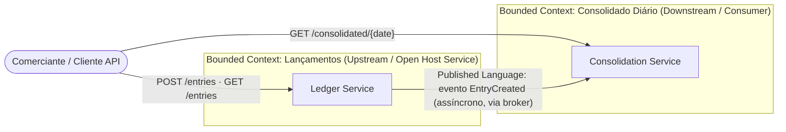

# Mapeamento de Domínios e Capacidades de Negócio

## Domínio de negócio

**Domínio Core**: Gestão de Fluxo de Caixa do Comerciante.

O comerciante precisa (1) registrar os lançamentos financeiros do seu dia a dia (débitos e créditos) e (2) enxergar, de forma consolidada, qual foi o resultado financeiro de cada dia. São duas necessidades relacionadas, mas com naturezas de uso e de carga muito diferentes — uma é transacional (escrita, deve estar sempre disponível), a outra é analítica (leitura agregada, tolera um pequeno atraso). Essa diferença é a base da decomposição em dois *bounded contexts* abaixo.

## Bounded Contexts

### 1. Lançamentos (Ledger)

**Tipo**: Core Subdomain — é a fonte da verdade financeira; sem ele não existe negócio.

**Responsabilidade**: registrar e manter o histórico imutável de lançamentos (débitos e créditos) do fluxo de caixa.

**Capacidades de negócio**:
- Registrar Lançamento (débito ou crédito, com valor, descrição e data de ocorrência)
- Consultar Lançamentos (histórico, para auditoria/reconciliação)
- Validar Lançamento (regras: valor positivo, tipo válido)

**Linguagem ubíqua**: Lançamento, Débito, Crédito, Valor, Descrição, Data de Ocorrência, Estorno.

**Modelo de dados**: append-only (um lançamento, uma vez criado, não é alterado nem removido — correções contábeis são feitas via um novo lançamento de estorno, nunca por `UPDATE`/`DELETE`). Essa é uma decisão de domínio, não só de implementação: um ledger financeiro auditável precisa preservar histórico completo.

### 2. Consolidado Diário (Daily Consolidation)

**Tipo**: Core Subdomain (é um dos dois entregáveis explícitos do desafio) mas **downstream** em relação a Lançamentos — não existe consolidado sem lançamentos.

**Responsabilidade**: manter e servir uma visão agregada (saldo diário) derivada dos lançamentos, otimizada para leitura.

**Capacidades de negócio**:
- Consolidar Saldo Diário (agregar lançamentos de um dia em totais de crédito/débito/saldo)
- Consultar Saldo Consolidado (relatório por dia ou por período)

**Linguagem ubíqua**: Saldo Consolidado, Saldo do Dia, Total de Créditos, Total de Débitos, Status de Consolidação.

**Modelo de dados**: read model materializado (`daily_balances`), recalculado incrementalmente a cada evento de lançamento recebido — nunca escrito diretamente por um cliente externo.

## Context Map

**Relação entre contextos**: *Upstream–Downstream* com **Published Language** — Lançamentos publica um contrato de evento estável (`EntryCreated`); Consolidado consome sem nunca escrever de volta nem compartilhar banco. Não há *Anticorruption Layer* formal porque o mesmo time mantém os dois contextos, mas o desacoplamento por evento já entrega a autonomia que uma ACL traria se os times se separassem.

**Por que dois bounded contexts e não um só**: ver [`docs/adr/0002-database-per-service.md`](adr/0002-database-per-service.md) e [`docs/adr/0001-event-driven-vs-sincrono.md`](adr/0001-event-driven-vs-sincrono.md) — a decisão não nasce de "achismo de microsserviços", nasce diretamente do requisito não-funcional descrito em [`01-requirements.md`](01-requirements.md#rnf-1-isolamento-de-falha).

## Subdomínios de suporte (genéricos, cross-cutting)

Não são domínio de negócio, mas cobrem os dois contextos: **Observabilidade** ([`04`](04-observability.md)) e **Identidade/Segurança** ([`05`](05-security.md)).
