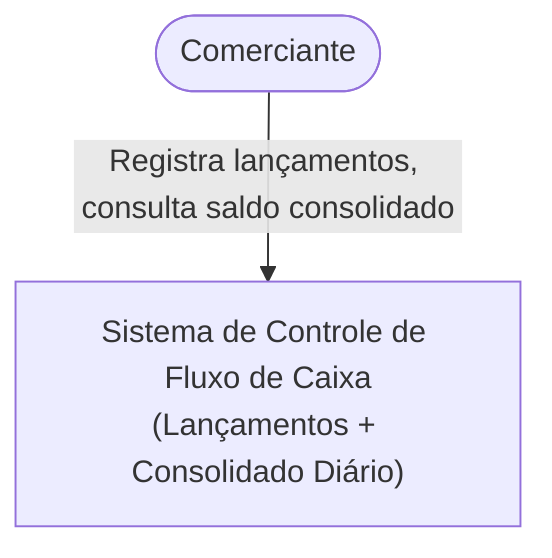
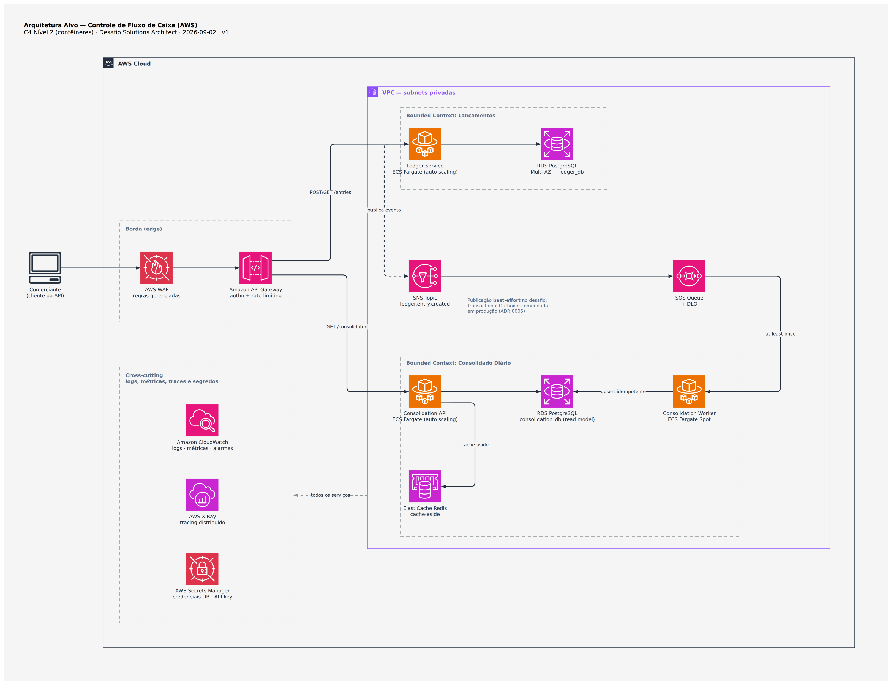
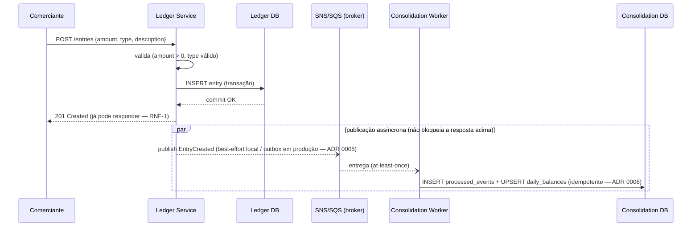
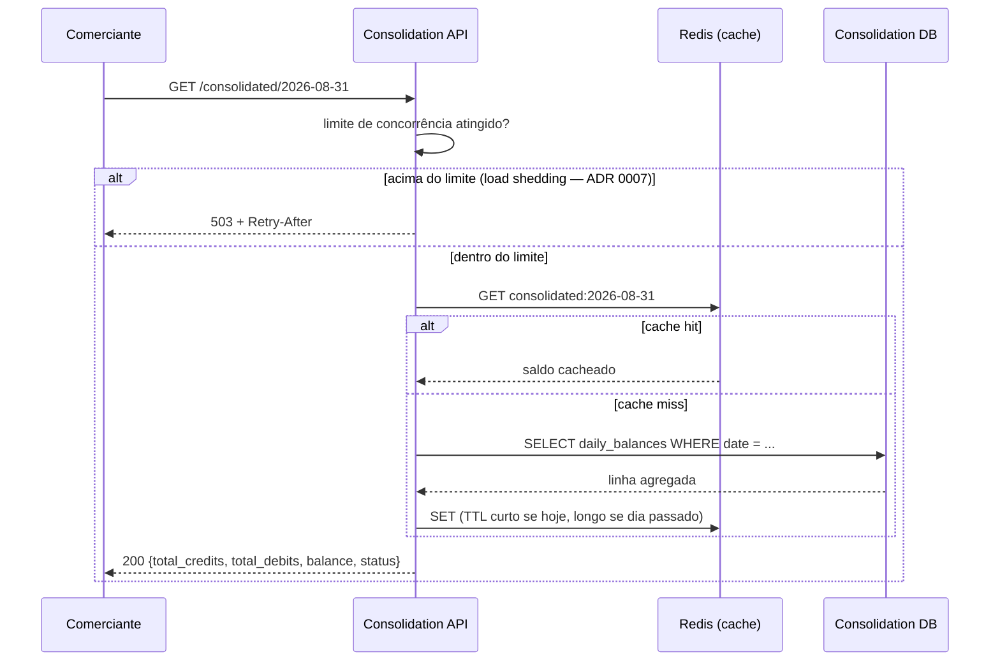

# Arquitetura Alvo (Target Architecture) — AWS

Este documento descreve a arquitetura de referência em produção. A implementação local deste repositório é uma versão simplificada dela — cada simplificação está documentada no respectivo ADR e resumida na tabela da seção 5.

## 1. Diagrama de Contexto (C4 — Nível 1)

## 2. Diagrama de Contêineres (C4 — Nível 2) — AWS

**Por que 3 tasks ECS e não 2**: o Consolidado é dividido em **API** (serve leitura, escala por tráfego HTTP) e **Worker** (consome a fila, escala por profundidade da fila) porque os dois têm perfis de carga e de escalonamento diferentes — acoplar os dois no mesmo processo forçaria a API a escalar junto com o volume de eventos (ou vice-versa) mesmo quando só um dos dois está sob pressão.

## 3. Fluxo de escrita — `POST /entries`

O ponto central deste diagrama: a resposta `201` ao comerciante **não espera** a publicação nem o consumo do evento — é isso que garante RNF-1 na prática, não apenas no papel.

## 4. Fluxo de leitura — `GET /consolidated/{date}`

## 5. Simplificações locais vs. arquitetura alvo

| Aspecto | Arquitetura Alvo (AWS) | Implementação local (desafio) | ADR |
|---|---|---|---|
| Broker | SNS + SQS (+ DLQ) | Redis Streams | [0004](adr/0004-broker-local-vs-aws.md) |
| Publicação do evento | Transactional Outbox + relay | Publish best-effort após commit | [0005](adr/0005-outbox-vs-publish-best-effort.md) |
| Banco por serviço | 2 instâncias RDS separadas | 1 instância Postgres, 2 databases lógicas | [0002](adr/0002-database-per-service.md) |
| Cache | ElastiCache Redis dedicado | Mesma instância Redis do broker | [0004](adr/0004-broker-local-vs-aws.md) |
| Autenticação | API Gateway + OAuth2/Cognito, mTLS interno | API Key simples (header `X-API-Key`) | [`05-security.md`](05-security.md) |
| Escalonamento horizontal | ECS Fargate auto scaling | Processo único por serviço (`docker-compose up --scale` opcional) | — |
| Tracing distribuído | AWS X-Ray / OpenTelemetry | Correlation ID em log estruturado | [`04-observability.md`](04-observability.md) |

## 6. Por que ECS Fargate (e não Lambda ou EKS)

- **Lambda** encaixaria bem no Worker (consumidor de fila; SQS→Lambda é padrão comum e barato) e fica registrado como alternativa mais econômica ali — ver [`06-cost-estimate-aws.md`](06-cost-estimate-aws.md). Não serve como padrão único porque Ledger e Consolidation API são serviços HTTP de longa duração que dependem de pool de conexões persistente ao RDS: cold start e limite de conexões simultâneas jogam contra.
- **EKS/Kubernetes** foi descartado por desproporção — cluster, control plane e add-ons para 3 serviços a 50 req/s. Fargate entrega auto scaling e isolamento por task sem esse custo operacional.
